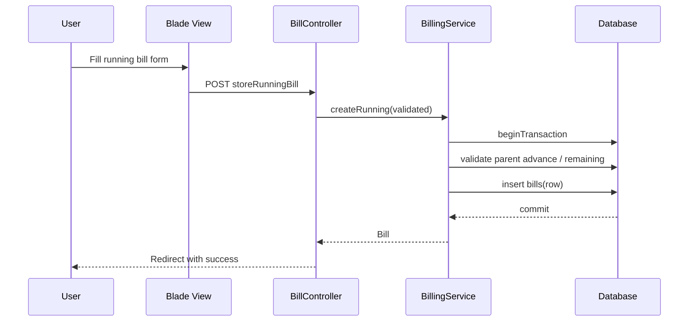

# Optimech Billing System — Technical Analysis

Date: 2025-11-21

## 1. System Architecture Overview

### Frontend Components (UI, Forms, Views)
- Blade views in `resources/views/dashboard/bills/`:
  - `create-advance.blade.php` — Advance bill form with hidden fields and PO capture. Posts to `bills.store-advance-bill` (`routes/web.php:62`–`67`).
  - `create-regular.blade.php` — Regular bill builder against delivered challans; uses Alpine-style reactivity (`x-data`, `x-model`). Posts to `bills.store` (`routes/web.php:54`).
  - `create-running.blade.php` — Running bill (installment) form linked to a parent advance bill; calculates percentage/amount client-side.
  - `edit-advance.blade.php`, `edit-running.blade.php`, `edit.blade.php` — Edit flows gated to latest bill per quotation.
  - `index.blade.php`, `regular.blade.php`, `running.blade.php`, `show.blade.php` — Listing, smart create selection, and printable views.
- UI uses Tailwind CSS classes and Blade components like `x-dashboard.layout.default`, `x-ui.form.input`.
- Client-side logic uses Alpine-like directives for totals and validation, e.g. grouped allocations in regular billing (`resources/views/dashboard/bills/create-regular.blade.php:182`–`205`).

### Backend Components (Controllers, Models, Services)
- Controller: `app/Http/Controllers/BillController.php` — orchestrates smart create flow, CRUD, and edits.
- Service: `app/Services/BillingService.php` — transactional creation/validation for advance, regular, running bills.
- Requests: `StoreRegularBillRequest.php`, `StoreAdvanceBillRequest.php`, `StoreRunningBillRequest.php` — strong validation rules per bill type.
- Models and relations:
  - `Bill` with `quotation`, `quotationRevision`, `parent`/`children`, `challans`, and `items` (`app/Models/Bill.php:51`–`93`).
  - `BillChallan` pivot (`app/Models/BillChallan.php`) and `BillItem` snapshots (`app/Models/BillItem.php`).
  - `Challan`, `ChallanProduct`, `Quotation`, `QuotationRevision` join the sales flow.
- Payments: `ReceivedBillController` records payments against a `Bill` and updates `paid`/`due`.

### Data Flow and Processing Logic
```mermaid
flowchart LR
  subgraph Sales
    Q[Quotation] --> QR[Active Revision]
    QR --> CH[Challan(s)]
  end
  subgraph Billing
    CH --> RB[Regular Bill]
    Q --> AB[Advance Bill]
    AB --> RNB[Running Bill(s)]
  end
  RB --> BI[Bill Items]
  RB -. many-to-many .- CH
  AB -->|children| RNB
  RNB -->|parent_bill_id| AB
  RB & AB & RNB --> PAY[Received Payments]
```
- Smart create selection in controller decides form based on quotation state:
  - Challans exist → regular bill view.
  - Existing advance bill → running bill view.
  - Otherwise → advance bill view (`app/Http/Controllers/BillController.php:118`–`157`).
- Regular bills snapshot delivered quantities per challan product, compute line totals, and maintain due based on siblings (`app/Services/BillingService.php:97`–`116`).

### Integration Points Between Layers
- Views post to named routes; controllers call `BillingService` for transactional operations.
- Eager loading ensures correct UI summaries (e.g., `BillController@index` loads quotations and latest revisions).
- Pivot `bill_challans` links bills to challans; `Bill.items()` traverses via `BillChallan` (`app/Models/Bill.php:83`–`93`).

## 2. Functional Breakdown

### Core Billing Features and Capabilities
- Advance bills: capture percentage/amount against quotation total, set initial `due`.
- Regular bills: bill delivered quantities from challans with allocations and totals.
- Running bills: incremental installments under a parent advance bill with remaining checks.
- Index metrics and history per quotation; latest-only edit guards.

### Payment Processing Workflow
- Payments recorded as `ReceivedBill` rows and summed to update `Bill.paid` and `Bill.due` (`app/Http/Controllers/ReceivedBillController.php:82`–`88`).
- Payments edit uses upsert and recalculates totals (`app/Http/Controllers/ReceivedBillController.php:180`–`195`).

### Invoice Generation Logic
- `invoice_no` unique across bills; running invoice numbers often composed from parent invoice with suffix in UI (e.g., `create-running` computes `INV-...-A/B/C`).
- Bill totals:
  - Regular: `(sum(line_total) - discount) + shipping` → `bill_amount` and `bill_percentage`; due computed against sibling bills (`app/Services/BillingService.php:97`–`116`).
  - Advance/Running: values provided by forms, validated in service/request.

### Reporting and Analytics Components
- Dashboard endpoints provide summaries: `getBillingData` (`app/Http/Controllers/BillController.php:387`–`397`) and top-level charts via `DashboradController` (e.g., due and target data).
- Bills index accumulates totals unique by quotation and due (`app/Http/Controllers/BillController.php:57`–`79`).

## 3. Technical Implementation Details

### Key Technologies and Frameworks
- Laravel (Routing, Controllers, Requests, Eloquent, Migrations, Validation, Auth).
- Blade + Tailwind CSS; Alpine-style interactivity for form state.
- Database: MySQL with normalized tables, indices for performance.

### Database Schema and Relationships
```php
// bills
Schema::create('bills', function (Blueprint $table) {
  $table->id();
  $table->foreignIdFor(Quotation::class)->constrained()->restrictOnDelete();
  $table->foreignIdFor(QuotationRevision::class)->nullable()->constrained()->nullOnDelete();
  $table->unsignedBigInteger('parent_bill_id')->nullable();
  $table->enum('bill_type', ['advance','regular','running'])->default('regular');
  $table->string('invoice_no')->unique();
  $table->date('bill_date');
  $table->date('payment_received_date')->nullable();
  $table->decimal('total_amount', 15, 2)->default(0);
  $table->decimal('bill_percentage', 5, 2)->default(0);
  $table->decimal('bill_amount', 15, 2)->default(0);
  $table->double('due')->default(0);
  $table->double('shipping')->default(0);
  $table->decimal('discount', 15, 2)->default(0.00);
  $table->enum('status', ['draft','issued','paid','cancelled'])->default('issued');
  $table->text('notes');
  $table->timestamps();
});
```
- Pivot `bill_challans` with indexes (`database/migrations/2025_11_03_055159_create_bill_challans_table.php:16`–`25`).
- `bill_items` snapshot quantities and unit price; maintain remaining (`database/migrations/2025_11_12_100001_create_bill_items_table.php:14`–`28`).
- Key relations in `Bill` (`app/Models/Bill.php:66`–`74`, `76`–`93`).

### API Endpoints and Their Purposes
- `GET /dashboard/bills` — index and metrics.
- Smart create: `GET /dashboard/billing/quotations/{quotation}/create` → selects appropriate form (`routes/web.php:62`–`67`).
- Create:
  - Regular: `POST /dashboard/bills` (`BillController@store`).
  - Advance: `POST /dashboard/billing/quotations/{quotation}/store-advance-bill`.
  - Running: `POST /dashboard/billing/quotations/{quotation}/store-running-bill`.
- Edit/update:
  - Advance: `PUT /dashboard/bills/{bill}/update-advance`.
  - Running: `PUT /dashboard/bills/{bill}/update-running`.
- Payments: `GET/POST /dashboard/received-bills` — record and manage payments.

### Security Measures and Compliance Aspects
- Auth and `CheckUserIsActive` middleware wrap dashboard routes (`routes/web.php:25`–`27`).
- Role checks ensure only admins or quotation owners can view/edit bills (`app/Http/Controllers/BillController.php:319`–`321`).
- Strict validation via FormRequests (e.g., unique `invoice_no`, date formats, numeric bounds).
- CSRF protection via Blade forms; transactional DB operations prevent partial writes.
- Recommendations: add audit logging for bill edits, PII minimization in views, enforce HTTPS and secure headers at the web server.

## 4. Performance Characteristics

### System Bottlenecks or Potential Issues
- Remaining quantity calculations loop over challan products and perform sums per item; potential N+1 impact on large datasets (`app/Http/Controllers/BillController.php:531`–`547`).
- Sibling due computation for regular bills sums across many rows per create; may be heavy on large quotations (`app/Services/BillingService.php:103`–`114`).
- Bills index aggregates by quotation in memory; could be optimized with SQL window functions or grouped queries (`app/Http/Controllers/BillController.php:47`–`71`).

### Scalability Considerations
- Indices exist on foreign keys and pivots; ensure composite indexes for frequent filters (e.g., `bill_type`, `status`, `quotation_id`).
- Consider denormalizing accumulated `regular_billed_sum` per quotation to reduce runtime sums.
- Paginate bills index for large data; add server-side filtering in list.

### Error Handling Mechanisms
- Exceptions converted to validation errors and user-friendly messages; `abort()` used for business rule violations (e.g., latest-only edit).
- Server logs capture failures (`app/Http/Controllers/BillController.php:83`, `180`).

## Code Snippets

### Smart Create Flow
```php
public function create(Request $request) {
  $quotationId = $request->query('quotation_id');
  $quotation = Quotation::with(['customer.company','revisions'=>function($q){
    $q->with(['products.product','products.specification','products.challanProducts','products.brandOrigin']);
  }])->findOrFail($quotationId);
  $challans = $this->getRevisionChallans($activeRevision);
  if ($parentBillId) return $this->createRunningView($quotation, $parentBill);
  if ($challans->isNotEmpty()) return $this->createRegularView(...);
  if ($existingAdvanceBill) return $this->createRunningView(...);
  return $this->createAdvanceView(...);
}
```
References: `app/Http/Controllers/BillController.php:104`–`157`.

### Regular Bill Totals and Due
```php
$finalTotal = ($totalAmount - ($bill->discount ?? 0)) + ($bill->shipping ?? 0);
$siblingsSum = DB::table('bills')
  ->where('quotation_id',$bill->quotation_id)
  ->where('bill_type','regular')
  ->where('status','!=','cancelled')
  ->where('id','!=',$bill->id)
  ->sum(DB::raw('COALESCE(bill_amount,0)'));
$computedDue = ($bill->total_amount ?? 0) - ($siblingsSum + $finalTotal);
```
References: `app/Services/BillingService.php:99`–`115`.

## Diagrams

### Sequence: Running Bill Creation


---

## Appendix: Key Files
- Views: `resources/views/dashboard/bills/*.blade.php`
- Controller: `app/Http/Controllers/BillController.php`
- Service: `app/Services/BillingService.php`
- Requests: `app/Http/Requests/Store*BillRequest.php`
- Models: `app/Models/Bill.php`, `BillItem.php`, `BillChallan.php`, `Challan.php`, `ChallanProduct.php`, `Quotation*.php`
- Routes: `routes/web.php`