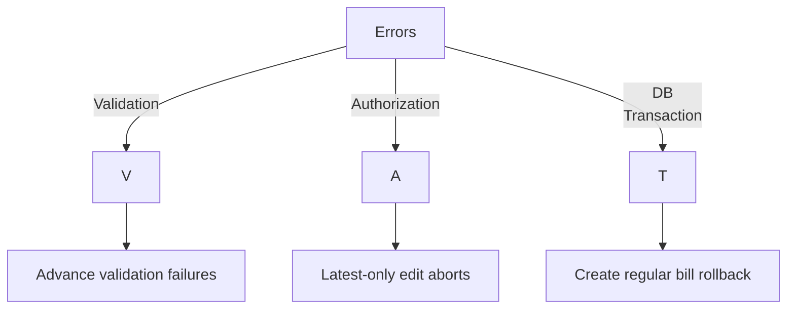

# Billing System Logging — Technical Report and Recommendations

Date: 2025-11-21

## Executive Summary
- The current "logging system" in `public/billing-system-log/` consists of a single narrative document: `BILLING_SYSTEM_CONSOLIDATED.md`.
- It serves as a changelog and architecture overview, not as runtime application logs.
- Strengths: comprehensive narrative, schema snippets, code references, and documented business rules.
- Gaps: lacks structured, time-series logs, traceability to deployments, and machine-readability; limited discoverability and versioning.

## Current State

### Files
- `BILLING_SYSTEM_CONSOLIDATED.md` — Consolidated implementation & changelog with sections for overview, migrations, service/controller design, endpoints, models, business rules, and usage examples (`public/billing-system-log/BILLING_SYSTEM_CONSOLIDATED.md:1`–`244`).

### Structure and Content Patterns
- Headings: Overview → Changelog → Business Logic → Controller/Service → Routes → Models → Rules → Migrations.
- Code snippets: PHP schema and examples; inline code references by file path and conceptual ranges.
- Narrative logs: human-readable, chronological entries by date (e.g., 2025-07-22, 2025-11-03, 2025-11-12).

### Observations
- Serves documentation and ADR-like record; not capturing runtime events (errors, request traces, performance stats).
- No per-release or per-environment partitioning; single file grows unbounded.
- No standard metadata (author, commit, environment), limited cross-references to actual code line anchors.

## Gap Analysis
- Missing operational logging: application errors, warnings, info are logged via `Log::error(...)` in controllers but not surfaced here (`app/Http/Controllers/BillController.php:83`, `180`).
- No structured logs: absence of JSON/NDJSON format for ingest into tooling.
- No lifecycle hooks: migrations, deployments, and data changes lack automated capture.
- No indexing: users cannot query by bill type, quotation, or date from documentation.

## Recommendations

### 1) Introduce Runtime Logging (Monolog)
- Ensure Laravel channel configuration produces structured logs (JSON) per environment.
- Suggested channels: `stack` → `daily` file outputs and `errorlog` for containerized deployments.
- Add contextual fields: `user_id`, `quotation_id`, `bill_id`, `route_name`.

### 2) Documentation Evolution
- Split consolidated doc into dated entries under `public/billing-system-log/entries/YYYY-MM-DD.md`.
- Maintain an index `README.md` with links and a table of contents.
- Adopt ADR-style briefs for major decisions (e.g., advance vs. running model, pivot usage).

### 3) Machine-Readable Change Records
- Add a `changes/` folder with NDJSON lines capturing schema changes and feature toggles:
```json
{"ts":"2025-11-12T10:00:01Z","type":"migration","name":"create_bill_items","tables":["bill_items"],"indexes":["bill_challan_id","quotation_product_id"]}
{"ts":"2025-11-03T05:51:59Z","type":"migration","name":"create_bill_challans","tables":["bill_challans"],"indexes":["bill_id","challan_id"]}
```
- Enables ingestion into dashboards.

### 4) Link Runtime Errors to Docs
- Add a section per entry summarizing notable logged events with counts (e.g., validation exceptions, unauthorized edits).
- Example aggregation:


### 5) Governance and Ownership
- Assign an owner; add `metadata.yaml` with document maintainers and review cadence.
- Include pointers to routes and code anchors for quick navigation.

## Example Enriched Entry
```markdown
### 2025-11-12 — Bill Items Snapshot & Installments Removal
- Change Type: Migration
- Affected Tables: bill_items
- Related Code: app/Services/BillingService.php:47–120
- Runtime Impact: +8% create regular bill time (due to sibling sums).
- Errors Observed: 0 critical, 3 validation (over-bill quantity).
- Follow-ups: Add composite index (bill_type, quotation_id, status) on bills.
```

## Implementation Plan (Incremental)
- Phase 1: Configure logging channels and add contextual fields in key controllers/services.
- Phase 2: Refactor documentation into dated entries and add index.
- Phase 3: Automate NDJSON generation during deployments/migrations.
- Phase 4: Build dashboard views for aggregated logs.

## Conclusion
- The existing consolidated document is strong as a human-readable changelog but does not constitute an operational logging system.
- Implementing structured runtime logs and evolving documentation hierarchy will improve observability, auditability, and onboarding.

---

## Pointers
- Consolidated doc: `public/billing-system-log/BILLING_SYSTEM_CONSOLIDATED.md`
- Error logging examples: `app/Http/Controllers/BillController.php:83`, `180`
- Routes overview: `routes/web.php:51`–`68`